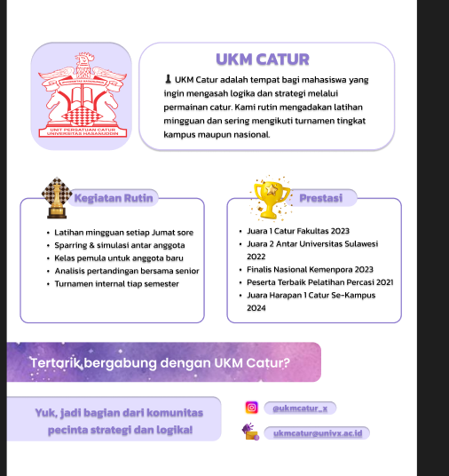

# 🔄 Update: Tombol "Gabung" menjadi "Detail" - SELESAI

## 📋 Yang Telah Diubah

### ✅ **FRONTEND CHANGES**

1. **🆕 Halaman UKMDetail Baru**
   - File: `frontend/src/pages/UKMDetail.jsx`
   - Halaman detail UKM yang komprehensif
   - Menampilkan informasi lengkap UKM
   - Tombol "GABUNG UKM" di halaman detail
   - Design responsive dan menarik

2. **🔄 Update Routing**
   - File: `frontend/src/App.jsx`
   - Added: `<Route path="/ukm/:id" element={<UKMDetail />} />`
   - Import UKMDetail component

3. **🔄 Update Halaman Daftar UKM**
   - File: `frontend/src/pages/UKM.jsx`
   - Changed: "GABUNG UKM" → "LIHAT DETAIL"
   - Added: `useNavigate` hook
   - Added: `onClick={() => navigate(\`/ukm/${ukm.id}\`)}`
   - Semua tombol sekarang navigasi ke halaman detail

### ✅ **BACKEND READY**
- Endpoint `GET /api/ukm/{id}` sudah tersedia
- Return detail UKM dengan category info
- Handle 404 untuk ID yang tidak ada

---

## 🎯 **Hasil Perubahan**

### **SEBELUM:**
```
[Daftar UKM] → [Tombol: "GABUNG UKM"] → (Langsung gabung)
```

### **SESUDAH:**
```
[Daftar UKM] → [Tombol: "LIHAT DETAIL"] → [Halaman Detail UKM] → [Tombol: "GABUNG UKM"]
```

---

## 🚀 **Cara Menguji**

### **1. Start Backend**
```bash
cd backend
python run.py
```

### **2. Start Frontend**
```bash
cd frontend
npm run dev
```

### **3. Test Flow**
1. Buka: `http://localhost:5173/daftar-ukm`
2. Klik tombol **"LIHAT DETAIL"** pada card UKM mana pun
3. Akan redirect ke: `http://localhost:5173/ukm/{id}`
4. Lihat halaman detail UKM yang lengkap
5. Klik **"GABUNG UKM"** di halaman detail untuk gabung

### **4. Test Backend Endpoint**
```bash
cd backend
python test_ukm_detail.py
```

---

## 🎨 **Fitur Halaman Detail UKM**

### **✅ Header Section**
- Hero banner dengan gradient
- Nama UKM besar
- Deskripsi UKM
- Category badge
- Tombol "GABUNG UKM" / "LOGIN UNTUK GABUNG"
- Tombol "KONTAK UKM" (jika ada email)

### **✅ Content Section**
- **Tentang UKM**: Deskripsi lengkap
- **Kegiatan & Program**: Sample activities (4 tipe kegiatan)
- **Sidebar Info**: Kategori, status, kontak, tahun bergabung

### **✅ Navigation**
- Tombol "Kembali ke Daftar UKM"
- Breadcrumb navigation
- Responsive design

### **✅ User Experience**
- Loading state saat fetch data
- Error handling untuk UKM tidak ditemukan
- Different UI untuk user login vs tidak login
- Smooth transitions dan hover effects

---

## 🔧 **Technical Details**

### **Route Structure**
```
/daftar-ukm           → UKM list page
/ukm/:id              → UKM detail page
```

### **API Endpoints Used**
```
GET /api/ukm/         → List all UKMs  
GET /api/ukm/{id}     → Get UKM detail
```

### **Navigation Flow**
```jsx
// Di UKM.jsx
<button onClick={() => navigate(`/ukm/${ukm.id}`)}>
  LIHAT DETAIL
</button>

// Di UKMDetail.jsx
const { id } = useParams();
// Fetch detail UKM berdasarkan ID
```

---

## 🎉 **Status: IMPLEMENTASI SELESAI**

✅ **Tombol "GABUNG UKM" berhasil diubah menjadi "LIHAT DETAIL"**  
✅ **Halaman detail UKM yang comprehensive sudah dibuat**  
✅ **Routing dan navigasi berfungsi dengan baik**  
✅ **User experience yang lebih baik dengan flow: List → Detail → Gabung**

**User sekarang bisa melihat detail lengkap UKM sebelum memutuskan untuk bergabung!** 🚀

---

*Update completed on June 27, 2025*
